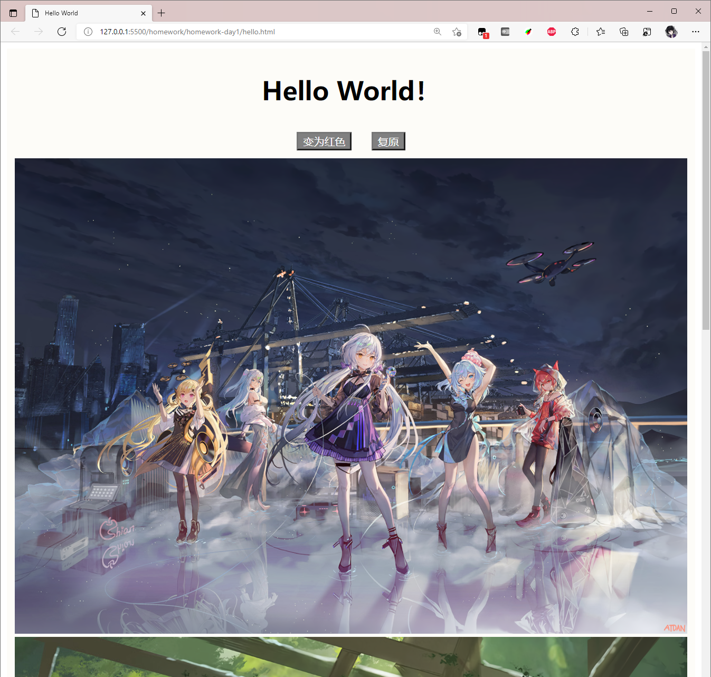
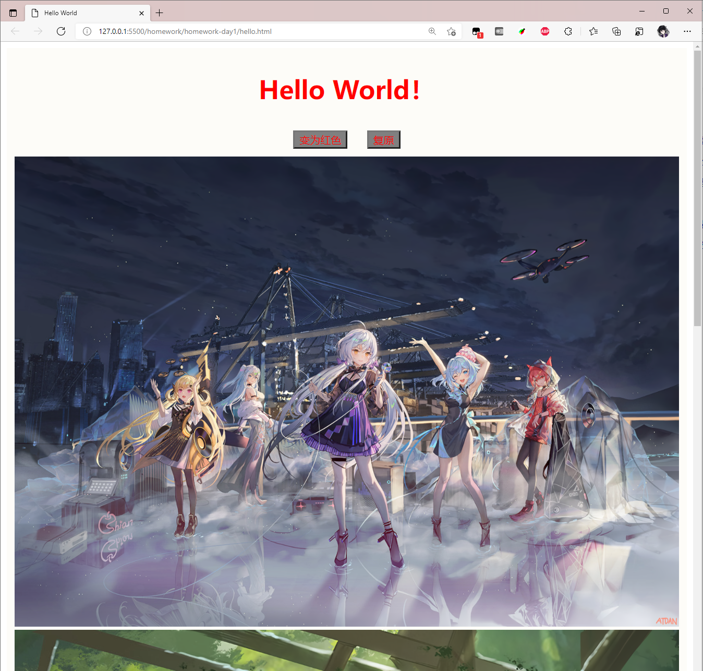
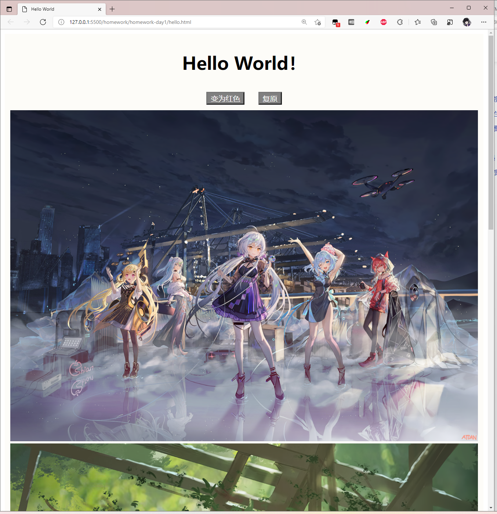
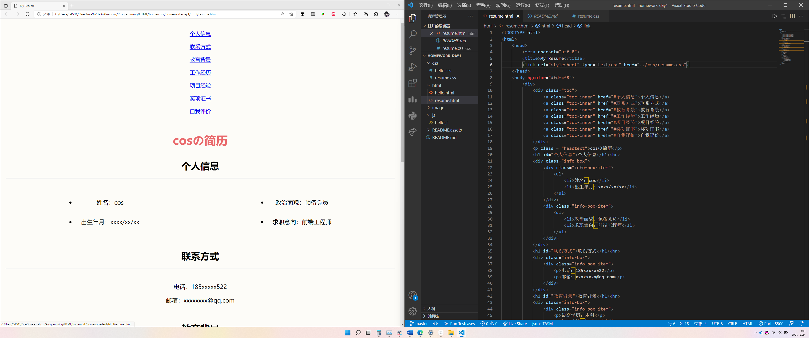
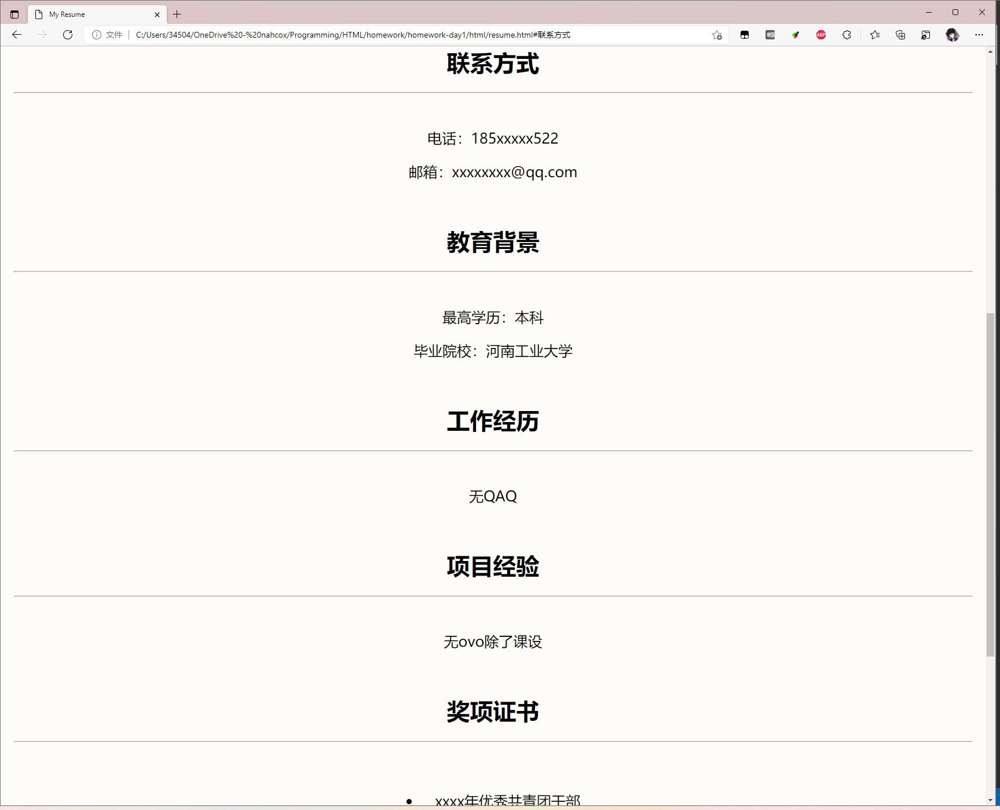

# HomeWork_Day1

姓名：余思娴

QQ：3450414733

## 预习作业：

学习 html、css、js 并尝试实现一个 hello world 页面，在页面中显示“Hello World！”以及两个按钮，点击“变为红色”按钮可以改变文字颜色为红色，点击“复原”按钮颜色恢复为默认颜色。

### 效果

打开时



点击变为红色按钮后



点击复原按钮后



### hello.html

```html
<!DOCTYPE html>
<html>
    <head>
        <meta charset="utf-8">
        <title>Hello World</title>
        <script src="hello.js"></script>
        <link rel="stylesheet" type="text/css" href="hello.css">
    </head>
    <body>
        <div>
            <h1 id = "text">Hello World！</h1>
            <button type="button" onclick="changeBtnColor()" id = "btn1">变为红色</button>
            <button type="button" onclick="recovery()"  id = "btn2">复原</button>
            
            
        </div>
    </body>
</html>
```

### hello.css

```css
div {
    background-color: #fdfcf8;
    margin: auto;
    padding: 10px;
    text-align:center;
}
button {
    background-color: gray;
    margin: 10px;
    color: white;
}
```

### hello.js

```javascript
// 改变按钮颜色
function changeBtnColor(){
    document.getElementById("text").style.color = "red";
    document.getElementById("btn1").style.color = "red";
    document.getElementById("btn2").style.color = "red";
}
// 复原
function recovery(){
    document.getElementById("text").style.color = "black";
    document.getElementById("btn1").style.color = "white";
    document.getElementById("btn2").style.color = "white";
}
```

## 预习材料：

[https://developer.mozilla.org/zh-CN/docs/Learn/Getting_started_with_the_web](https://developer.mozilla.org/zh-CN/docs/Learn/Getting_started_with_the_web)

## 附加题

请完成个人简历 resume.html 

http://ife.baidu.com/htmlpart/onlineCv.html

### 完成结果



点击链接可跳转



### resume.html

```html
<!DOCTYPE html>
<html>
    <head>
        <meta charset="utf-8">
        <title>My Resume</title>
        <link rel="stylesheet" type="text/css" href="../css/resume.css">   
    </head>
    <body bgcolor="#fdfcf8">
        <div>
            <div class="toc">
                <a class="toc-inner" href="#个人信息">个人信息</a>
                <a class="toc-inner" href="#联系方式">联系方式</a>
                <a class="toc-inner" href="#教育背景">教育背景</a>
                <a class="toc-inner" href="#工作经历">工作经历</a>
                <a class="toc-inner" href="#项目经验">项目经验</a>
                <a class="toc-inner" href="#奖项证书">奖项证书</a>
                <a class="toc-inner" href="#自我评价">自我评价</a>
            </div>
            <p class = "headtext">cosの简历</p>
            <h1 id="个人信息">个人信息</h1><hr>
            <div class="info-box">
                <div class="info-box-item">
                    <ul>
                        <li>姓名：cos</li>
                        <li>出生年月：xxxx/xx/xx</li>
                    </ul>
                </div>
                <div class="info-box-item">
                    <ul>
                        <li>政治面貌：预备党员</li>
                        <li>求职意向：前端工程师</li>
                    </ul>
                </div>
            </div>
            <h1 id="联系方式">联系方式</h1><hr>
            <div class="info-box">
                <div class="info-box-item">
                    <p>电话：185xxxxx522</p>
                    <p>邮箱：xxxxxxxx@qq.com</p>
                </div>
            </div>
            <h1 id="教育背景">教育背景</h1><hr>
            <div class="info-box">
                <div class="info-box-item">
                    <p>最高学历：本科</p>
                    <p>毕业院校：河南工业大学</p>
                </div>
            </div>
            <h1 id="工作经历">工作经历</h1><hr>
            <div class="info-box">
                <div class="info-box-item">
                    <p>无QAQ</p>
                </div>
            </div>
            <h1 id="项目经验">项目经验</h1><hr>
            <div class="info-box">
                <div class="info-box-item">
                    <p>无ovo除了课设</p>
                </div>
            </div>
            <h1 id="奖项证书">奖项证书</h1><hr>
            <div class="info-box">
                <div class="info-box-item">
                    <ul>
                        <li>xxxx年优秀共青团干部</li>
                        <li>xxxx年优秀学生奖学金</li>
                        <li>xxxx年蓝桥杯省二等奖</li>
                        <li>xxxx年icpc省赛银</li>
                    </ul>
                </div>
            </div>
            <h1 id="自我评价">自我评价</h1><hr>
            <p>摸鱼人- -</p>
        </div>
    </body>
</html>
```

### resume.css

```css
div {
    background-color: #fdfcf8;
    margin: auto;
    padding: 10px;
    text-align:center;
}
li {
    padding: 20px;
}
.headtext {
    color: #e9686b;
    text-align: center;
    font-size: 40px;
    font-weight: bold;
}
.toc {
    display: flex;
    justify-content: center;
    flex-direction: column;
}
.toc-inner {
    font-size: 18px;
    margin: 10px;
}
.info-box {
    display: flex;
    justify-content: center;
}

.info-box-item{
    font-size: 20px;
}
```

## 

## 作业提交链接

day01作业提交
https://docs.qq.com/form/page/DTHpGemtDVWlGb0lH

## 注意事项
记得修改 README.md 中的姓名与 QQ号方便兑奖与统计

fork 仓库后修改自己仓库文件就好，不需要 Pull Request
