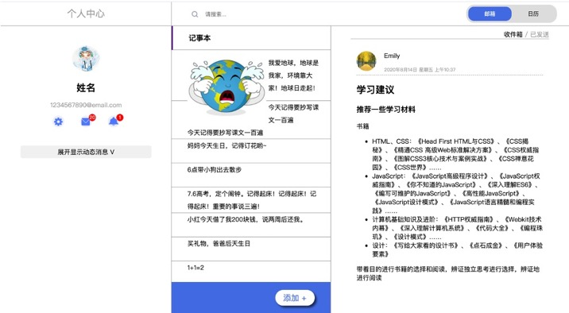

# HomeWork_Day2

姓名：余思娴

QQ：3450414733

## 课程资料
1. html 常用标签
https://jsbin.com/libapuk/edit?html,css,output

2. 实例
https://jsbin.com/wimuviy/edit?html,css,output

3. 实例示意图
https://roy-tian.github.io/learning-area/html/introduction-to-html/structuring-a-page-of-content-finished/

4. css引用
https://jsbin.com/kegudun/edit?html,css,output

5. 选择器
https://jsbin.com/pawuzim/edit?html,css,output

6. css 样式
https://jsbin.com/poyaniy/edit?html,css,output

## 预习资料：
开始学习 HTML：  [https://developer.mozilla.org/zh-CN/docs/learn/HTML/Introduction_to_HTML/Getting_started](https://developer.mozilla.org/zh-CN/docs/learn/HTML/Introduction_to_HTML/Getting_started)

HTML 元素参考： [https://developer.mozilla.org/zh-CN/docs/Web/HTML/Element](https://developer.mozilla.org/zh-CN/docs/Web/HTML/Element)

语义化： [https://developer.mozilla.org/zh-CN/docs/Glossary/%E8%AF%AD%E4%B9%89](https://developer.mozilla.org/zh-CN/docs/Glossary/%E8%AF%AD%E4%B9%89)

开始学习css : [https://developer.mozilla.org/zh-CN/docs/Learn/Getting_started_with_the_web/CSS_basics](https://developer.mozilla.org/zh-CN/docs/Learn/Getting_started_with_the_web/CSS_basics)

构建内容丰富的网页:[https://developer.mozilla.org/zh-CN/docs/Learn/HTML/Introduction_to_HTML/Structuring_a_page_of_content](developer.mozilla.org/zh-CN/docs/Learn/HTML/Introduction_to_HTML/Structuring_a_page_of_content)

了解flex 布局，常用属性 [https://developer.mozilla.org/zh-CN/docs/Web/CSS/flex](https://developer.mozilla.org/zh-CN/docs/Web/CSS/flex)

了解定位 position 属性 (ttps://developer.mozilla.org/zh-CN/docs/Learn/CSS/CSS_layout/%E5%AE%9A%E4%BD%8D)[https://developer.mozilla.org/zh-CN/docs/Learn/CSS/CSS_layout/%E5%AE%9A%E4%BD%8D]

了解浮动 float 属性 (https://developer.mozilla.org/zh-CN/docs/Learn/CSS/CSS_layout/Floats)[https://developer.mozilla.org/zh-CN/docs/Learn/CSS/CSS_layout/Floats]

响应式设计[https://developer.mozilla.org/zh-CN/docs/Learn/CSS/CSS_layout/Responsive_Design](https://developer.mozilla.org/zh-CN/docs/Learn/CSS/CSS_layout/Responsive_Design)

## 预习作业：

0. 学习 HTML 调试：[https://developer.mozilla.org/zh-CN/docs/Learn/HTML/Introduction_to_HTML/Debugging_HTML](https://developer.mozilla.org/zh-CN/docs/Learn/HTML/Introduction_to_HTML/Debugging_HTML)

1. 用 HTML 实现信件 Demo：[https://developer.mozilla.org/zh-CN/docs/Learn/HTML/Introduction_to_HTML/Marking_up_a_letter](https://developer.mozilla.org/zh-CN/docs/Learn/HTML/Introduction_to_HTML/Marking_up_a_letter)

2. 实现loading动画：[https://www.freecodecamp.org/news/how-to-build-a-delightful-loading-screen-in-5-minutes-847991da509f/](https://www.freecodecamp.org/news/how-to-build-a-delightful-loading-screen-in-5-minutes-847991da509f/)

3. 使用 flex 布局实现一个方块在页面中的垂直水平居中

4. 使用定位实现一个方块在页面中的垂直水平居中

5. 写一个简单的响应式demo：随屏幕大小变化方块的颜色
 
## 附加题

尝试使用flex布局/定位去实现右图的布局；

## 提交链接

HomeWork02作业提交
https://docs.qq.com/form/page/DYWx2YU9yU2VGa0xO

## 注意事项
记得修改 README.md 中的姓名与 QQ号方便兑奖与统计

fork 仓库后修改自己仓库文件就好，不需要 Pull Request
## 结果链接
博客：https://cosine.ren/index.php/%e5%89%8d%e7%ab%af%e5%ad%a6%e4%b9%a0/